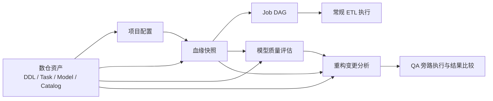

# 项目核心设计

本目录只记录帮助理解项目的长期设计。开发计划、迁移步骤、测试清单、评审记录和单次场景验收不属于设计事实，完成后不在这里保留。

## 文档索引

核心架构：

- [血缘与作业执行设计](lineage-and-execution.md)
- [模型元数据与质量评估设计](metadata-and-assessment.md)
- [Schema Identity 与 DDL 演进设计](schema-evolution.md)
- [数仓重构验证设计](refactor-verification.md)

评估专题设计：

- [Assess 规则引擎设计原则](assess_rule_design.md)
- [Assess 评分标准](assess_scoring_guide.md)

元数据初始化命令与操作步骤不属于设计事实，参见
[Assess 元数据初始化与刷新](../assess_metadata_initialization.md)。

## 项目要解决的问题

数仓重构不只是修改 SQL。一次变化可能同时影响表结构、字段血缘、作业顺序、模型语义、历史分区和下游数据。项目围绕三个问题构建：

1. 从仓库中的 DDL、Task SQL 和 Model YAML 恢复可计算的数仓事实。
2. 用统一事实驱动作业执行、质量评估和影响范围分析。
3. 在不写生产库的前提下，证明一次重构是否满足预期语义。

整体数据流如下：

## 事实来源

项目坚持“仓库资产是源，运行产物是派生结果”。同一个概念只设置一个权威来源，避免通过文件名或表名前缀重复猜测。

| 事实 | 权威来源 | 说明 |
| --- | --- | --- |
| 项目目录、数据库、方言、执行默认值、QA 池 | `warehouses/{project}/warehouse.yaml` | 项目级配置入口 |
| 物理表结构 | `ddl/**/*.sql` | Doris 表、字段和稳定 schema identity |
| 数据转换 | `tasks/**/*.sql` | Job 的输入、输出和字段表达式 |
| 表层级、表类型、执行方式、粒度和指标 | `models/**/*.yaml` | `layer` 不通过表名前缀兜底推断 |
| 人工治理的业务域和业务板块 | `business_taxonomy.yaml` | 稳定主数据，不由 LLM 自动创造 |
| 业务过程和语义主题字典 | `business_processes.yaml`、`semantic_subjects.yaml` | 为事实表和维度表提供语义代码 |
| 血缘、DAG、评估和重构结果 | `artifacts/` | 可重建、可版本化，但不是资产定义 |

## 模块边界

### 配置与资产

配置层负责把一个项目解析为统一的资产目录和数据库上下文。上层模块只通过配置与资产 API 找文件，不自行拼接某个项目的路径。

### 血缘与执行

血缘层把 SQL 解析为 Dataset、Job 和 Edge，并由 Job 的输入输出生成 DAG。执行层只消费经过校验的 DAG 与 Model 执行配置，不重新实现血缘判断。

详见 [血缘与作业执行设计](lineage-and-execution.md)。

### 元数据与评估

元数据层连接技术资产和业务语义；评估层在统一上下文上运行规则，输出可解释、可稳定比较的问题，而不是直接修改数仓资产。

详见 [模型元数据与质量评估设计](metadata-and-assessment.md)。

### Schema 演进

Schema identity 为表和字段提供独立于名称的稳定身份，DDL 推导据此区分重命名、修改和替换。

详见 [Schema Identity 与 DDL 演进设计](schema-evolution.md)。

### 重构验证

重构模块冻结修改前基线，计算修改后的影响范围和最小执行集合，在预建 QA 库中旁路运行，再把 QA 结果与生产结果比较。

详见 [数仓重构验证设计](refactor-verification.md)。

## 关键设计原则

- **单一事实来源**：层级、执行策略和业务语义均读取显式配置，不依赖命名猜测。
- **派生结果可重建**：血缘、DAG、评估与验证计划均从资产重新生成，避免增量补丁残留旧事实。
- **名称与身份分离**：SQL 标识符按 Doris 语义大小写不敏感匹配；展示名称保留原样；重命名依靠稳定 UUID。
- **宽分析、窄执行**：影响分析可以覆盖完整下游，实际执行只选择证明本次变化所需的 Job。
- **失败关闭**：生产者歧义、身份缺失、计划过期或 QA ownership 不一致时停止，不猜测或降级执行。
- **生产只读**：常规重构验证从生产读取输入，所有重算输出只写入已领取的 QA 数据库。

## 文档边界

核心设计按五个长期视角组织：总体架构、血缘与执行、元数据与评估、Schema 演进、重构验证。评估规则引擎和评分口径作为需要独立维护的专题约束放在同一目录。它们共同覆盖过程表、DAG 并发、最小重算、语义 Compare、QA 数据库池和质量评估等核心机制。

以下内容不单独维护为设计文档：

- 日期化的实施计划和阶段任务；
- 性能基准的生成参数与跑数步骤；
- Code Review 页面和评审记录；
- 单个示例项目的验收过程；
- CLI 参数全集、JSON 字段全集和测试用例清单。

这些信息应分别放在代码、CLI help、测试、开发指南或 Git 历史中。设计变化时只更新受影响的核心文档，避免复制实现细节。
