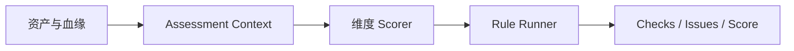

# 模型元数据与质量评估设计

## 场景与问题

DDL 能描述字段，Task SQL 能描述计算，却无法完整回答“这张表属于哪一层、代表哪个业务过程、粒度是什么、哪些字段是指标”。如果这些信息只存在于命名约定或 LLM 输出中，执行和治理都会变得不可重复。

本设计把业务语义、表级 Model 和评估规则分层管理：人工主数据保持稳定，Model 记录表级事实，程序规则负责确定性检查，LLM 只辅助语义发现。

## 核心概念

| 概念 | 作用 |
| --- | --- |
| Data Domain | 数据域，人工维护的稳定业务分类 |
| Business Area | 业务板块，人工维护并归属于数据域 |
| Business Process | 可度量的业务事件，主要归属事实表和指标 |
| Semantic Subject | 维度表所描述的主实体或主题 |
| Entity | 表中的主实体或关联实体，以及其键字段 |
| Grain | 一行数据代表的实体键和时间粒度 |
| Metric | 原子、派生或计算指标 |
| Assessment Context | 评估规则共享的只读资产、血缘、索引和配置 |

## 元数据分层

### 业务语义目录

业务语义拆成三份文件：

- `business_taxonomy.yaml`：人工治理的 `data_domains` 和 `business_areas`；
- `business_processes.yaml`：事实表可引用的业务过程字典；
- `semantic_subjects.yaml`：维度表可引用的语义主题字典。

Taxonomy 是治理锚点。LLM 可以从表和指标中聚类业务过程或语义主题，但不能自动扩充数据域和业务板块；发现结果只有在引用已确认 taxonomy code 时才能补充对应归属。

### Model YAML

Model 是表级元数据的权威来源，主要记录：

- `layer`、`table_type` 和描述；
- `execution.materialized`、slice 与 full refresh 策略；
- `data_domain`、`business_area`、`business_process` 或 `semantic_subject`；
- entities、grain 和指标分组。

表层级只读取 Model 的 `layer`。Catalog 提供可用 code 和治理关系，不反向替代每张表自己的归属声明。

## 初始化与刷新

元数据写入有两个不同场景：

### Generate

用于冷启动重建 Model。它从 Catalog、DDL、Task SQL 和血缘生成新的模型集合，不把现有 Model 当作推断先验。正式执行前会清理当前 Model，因此必须先 dry-run 并通过 Git 审查变化。

### Refresh

用于维护已有 Model。默认不调用 LLM，只做确定性同步：创建缺失文件、刷新基础技术字段、校验已有业务 code，并从 Catalog 补齐能够确定的治理关系。它不会根据表名猜业务过程，也不会修改 DDL 或 Task SQL。

启用 LLM 后，每张表以一次结构化巡检补充表类型、层级建议、entities、grain 和指标分组。返回结果必须通过以下约束后才能写入：

- 字段必须真实存在于 DDL；
- 同一字段不能进入重复分组；
- 业务 code 必须存在于已加载目录；
- DIM 不写指标分组；
- 无法通过校验的表标记为 blocked，不部分写入。

## 实现模块边界

模型元数据命令仍以
`dw_refactor_agent.assessment.llm.model_metadata_writer` 作为稳定 CLI 和兼容导入入口。
内部实现按职责拆分：

- `model_metadata_writer.py`：CLI 参数、项目级工作流编排、报告汇总和兼容导出；
- `model_metadata_updates.py`：巡检上下文、层级解析、指标与实体/grain 规范化、Model YAML 更新；
- `model_metadata_generation.py`：冷启动候选规划、Catalog 合并、文件渲染和事务化发布；
- `model_metadata_catalog.py`：Catalog 到 Model 的确定性映射与目录发现结果回写；
- `model_metadata_runtime.py`：跨模块共享的运行时项目根目录解析。

新增逻辑应放入对应职责模块，避免把纯映射、文件发布或 YAML 规范化逻辑重新放回 CLI
入口。测试按相同边界拆分为 updates、generation 和 catalog 三组，共享样例与 fixture
集中在 `model_metadata_writer_test_support.py`。

## 评估架构

评估过程分为四层：



### Assessment Context

Context 统一加载并缓存 DDL、Model、Task、血缘、Catalog 和命名配置。昂贵事实使用懒加载查询，只计算被规则实际使用的部分。

### 维度 Scorer

Scorer 选择本维度的检查对象，例如表、依赖边、Task 或文件，并准备可被多条规则复用的通用事实。它负责汇总得分，不提前生成某条规则的违规结论。

### Rule Runner 与 Rule

Runner 只负责规则注册、选择、调用和返回值标准化，不包含具体业务规则分支。Rule 自己判断是否适用并返回检查结果：

- `None`：不适用，不进入检查集合；
- `passed=true`：适用且通过；
- `passed=false`：适用且失败。

这一边界保证新增规则通常只需要增加规则类、规则元信息和测试，而不修改通用引擎。

### Issue 与稳定指纹

Check 是规则执行事实，Issue 是面向用户的失败诊断。显示 ID 可以随排序变化，跨次评估比较依赖稳定 fingerprint：

```text
dimension | rule_id | target.type | target.name | 可选判别字段
```

动态错误文案、LLM confidence 和运行时间不参与指纹。重构验证据此识别新增、持续和已修复问题。

## 核心评估算法

### 规则评分

不同维度可使用不同评分函数，例如通过率、平均值或带严重度上限的扣分。总体分只对本次选中的维度按权重归一化：

```text
overall = sum(维度分 × 维度权重) / sum(选中维度权重)
```

具体维度、权重和阈值属于可调整策略，统一记录在 [Assess 评分标准](assess_scoring_guide.md)，不复制到核心设计中。

### 范围评估

重构分析不必每次重跑所有规则。范围规划根据变化类型扩大必要闭包：

- DDL、Model 或 Task 变化：检查直接表、相关依赖边和必要上下游；
- 命名配置变化：扩大到命名维度的相关资产；
- 业务语义目录变化：扩大到引用相关 code 的 Model；
- 全局规则配置变化：对应维度全量执行。

范围只影响检查对象，不改变规则语义。当前资产已经删除的对象不会因为旧 scope 名称而重新进入 Context。

## LLM 边界

LLM 适合处理业务语义聚类、表类型判断和歧义解释，不承担以下职责：

- 生成或修改人工治理的 taxonomy；
- 证明 SQL 等价；
- 绕过 DDL 字段、Catalog code 或 Model schema 校验；
- 直接决定规则是否通过；
- 在无人工审查时批量接受不可逆元数据变化。

没有 LLM 时，Catalog 刷新、规则评估和常规执行仍应完整可用。API 失败不能破坏已有 Model。

## 设计边界

- 评估是诊断系统，不自动重写数仓资产。
- Catalog 是字典，Model 是表级归属，两者不能混为一份事实。
- 命名规范表达格式约束，不承担业务主数据发现。
- 规则只读取 Context，不产生外部副作用。
- 详细初始化命令见 [Assess 元数据初始化与刷新](../assess_metadata_initialization.md)，规则扩展原则见 [Assess 规则引擎设计原则](assess_rule_design.md)。
