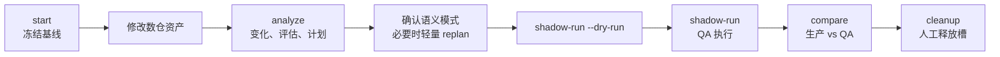

# 数仓重构验证设计

## 场景与问题

数仓重构需要同时回答三个问题：

1. 哪些资产和下游语义受到影响？
2. 为验证变化，最少需要重算哪些 Job 和时间切片？
3. QA 结果是否来自这份代码、这份计划和这次执行，而不是陈旧产物或被其他任务覆盖的数据库？

系统采用“冻结基线—分析变化—QA 旁路执行—生产/QA 比较”的会话模型。生产库始终只读，所有重算结果写入预建 QA 数据库池。

## 核心概念

| 概念 | 含义 |
| --- | --- |
| Run | 一次逻辑重构会话，包含基线、当前事实、分析和验证意图 |
| Execution | 某个 Run 的一次实际 shadow-run 尝试；一个 Run 可以重试多次 |
| Manifest | Run 的稳定入口和产物索引，只保存少量固定上下文与用户意图 |
| Affected scope | 用于解释和评估的宽影响范围，不等于执行范围 |
| `jobs_to_run` | 本次 QA 中真正执行的最小 Job 集合 |
| Anchor | 用于证明或观察变化结果的比较边界表 |
| Semantic mode | 表的预期语义：`equivalent`、`changed`、`unknown` |
| QA slot | DBA 预建、由一次 Execution 独占的数据库 |
| Fingerprint | 绑定资产、计划、工具代码和执行结果的稳定摘要 |

## Run 生命周期



### Start

`start` 在修改前冻结完整血缘、Task cache 和全项目评估，并记录 Git branch、commit 与 dirty 状态。Baseline 在同一个 Run 内只读。

### Analyze

`analyze` 从当前工作区重建血缘，计算变化资产、血缘差异、范围评估、问题 diff 和验证计划。它可以重复运行；每次开始先使旧 plan、shadow result 和 compare result 失效，避免失败后误用旧结果。

### Shadow-run 与 Compare

Shadow-run 先编译路由与执行计划，再在 QA slot 中创建必要结构和执行 Job。Compare 只消费同一 plan 对应的已完成 execute 结果，并按 plan 中的 checks 比较生产和 QA。

## 变化与评估范围

变化分析综合四类证据：

- Git 中变化的 DDL、Task、Model 和项目配置；
- 基线与当前血缘的新增、删除和变化 Edge；
- Schema identity 建立的表/字段 rename mapping；
- 受影响图中的直接表、下游表、评估对象和候选 Anchor。

`affected_scope` 故意偏宽，用来回答“可能影响哪里”；它包含的表或 Task 不会自动进入 QA 执行。

评估结果通过稳定 issue fingerprint 比较，得到新增、持续和已修复问题。问题 diff 是解释性产物，不参与 Job 调度。

## 语义模式

直接变化不总是要求新旧表相等。例如纯重命名通常预期 `equivalent`，有意调整口径则是 `changed`，无法确定时为 `unknown`。

三种模式的行为：

| 模式 | 本表比较 | 下游传播 |
| --- | --- | --- |
| `equivalent` | 本表做权威等值比较 | 完整可比较时在本表停止 |
| `changed` | 不做错误的本表等值断言 | 继续寻找下游语义边界 |
| `unknown` | 可做观察性比较 | 继续传播并保留 warning |

### 解析优先级

语义按受影响 DAG 的拓扑顺序解析：

```text
当前有效用户声明
  > 已确认历史声明
  > changed/unknown 上游传播
  > 严格自动等价
  > 默认 unknown
```

用户声明绑定表的稳定 identity 与语义上下文 fingerprint。表的资产、受影响上游或上游最终模式变化后，旧声明自动失效。声明可以跨相同上下文的 Run 复用，但不会写入 Model 成为永久属性。

### 自动等价边界

自动规则只接受能够严格证明的情况：

- 相关资产未变且所有受影响上游等价；
- Task 只改注释、空白或格式，规范化 AST 相同；
- 基于稳定 `table_id` / `column_id` 的纯重命名，且 DDL、Model 和 Task 在应用 rename mapping 后等价。

过滤、JOIN、聚合、去重、窗口、NULL 处理、粒度或指标表达式变化都不会自动判为等价。系统也不让 LLM 决定 `equivalent` 或 `changed`。

## 最小执行与 Anchor 选择

语义解析完成后才选择 Job：

```text
jobs_to_run = 可执行的直接变化 Job
            ∪ changed/unknown 到选定下游边界之间的 Job
            ∪ rename 引用传播或显式要求的 Job
```

直接变化且可完整比较的 `equivalent` 表是停止边界，未修改下游不重算。`changed` 或 `unknown` 沿下游寻找最近的 `equivalent` 物化表；如果没有，则选择结构可比较的叶子作为观察性 Anchor。

时间窗口沿血缘向上换算不同周期，但只给已经进入 `jobs_to_run` 的 Job 分配 execution values。未选择的上游表从生产读取，不因宽评估范围而被复制或重算。

需要在 QA 中准备的基线 DDL 也只覆盖：最终 Anchor、待运行且不是 Phase 2 新建的目标、ALTER 目标和 rename 的旧表。DDL 文件作为独立 SQL artifact 保存，并由摘要绑定到 plan，避免庞大 SQL 内嵌和静默漂移。

## Shadow 路由

Shadow manifest 在执行前把每个关系编译为明确的读写位置：

- ODS 和未重算上游从生产库读取；
- 本次已经在 QA 就绪的上游结果从 QA 读取；
- 所有选中 Job 的输出写入 QA；
- DDL-only、自读增量等需要初始数据的关系按精确行范围 prefill；
- Task 引用保留 marker 或路由无法确定时产生 blocker。

实际执行阶段为：

1. 预编译 manifest，先发现与物理 QA 槽无关的 blocker；
2. 原子领取 QA slot，并用实际数据库重新编译路由；
3. 校验外置 baseline DDL，创建所需基线表；
4. 按 manifest 预填充必要生产数据；
5. 应用 DDL changes；
6. 按 Job DAG 执行 `jobs_to_run`。

Job 并发遵守 DAG ready 条件，`parallel` 是全局数据库 Session 上限。失败后不再提交新的下游 Job，已运行任务允许收尾并记录结果。

## QA 数据库池

运行时不创建或删除数据库。DBA 在 `warehouse.yaml` 中配置一组预建 QA slot，QA 账号只拥有这些库的表级权限。

每次实际执行生成唯一 execution ID，并通过保留表 `dw_refactor_execution_marker` 原子领取一个空槽：

```text
1. 轮转候选槽，检查槽为空；
2. 不带 IF NOT EXISTS 创建 marker；
3. 创建成功者写入不可变 ownership；
4. 立即回读并校验 run、execution、数据库和 fingerprints；
5. 竞争失败则尝试下一个槽；所有槽占用则失败。
```

Marker 的创建由 Doris 元数据保证跨机器互斥。执行成功、失败或进程被终止后都保留槽，便于排查；只有显式 cleanup 才释放。清理先删除业务对象，最后删除 marker，数据库本身保留。

Dry-run 不连接数据库、不领取槽，因而不能作为 Compare 凭据。

## 新鲜度与执行溯源

Plan 必须同时绑定“分析了什么”和“将执行什么”：

- workspace fingerprint 覆盖项目 DDL、Task、Model、配置、业务语义和相关工具源码；
- analysis input fingerprints 绑定基线/当前血缘、change analysis、Manifest 固定上下文和用户意图；
- plan fingerprint 覆盖完整 plan 与所有外置 baseline DDL 摘要；
- shadow result 记录实际 QA slot、execution ID、workspace 与 plan fingerprint；
- QA marker 保存同一组 ownership 信息；
- compare result 再绑定 shadow execution/result fingerprint。

Shadow-run 和 Compare 在打开业务数据库连接前重新校验这些关系。工作区变化、Plan 被编辑、运行时代码来自另一个 worktree、Marker 被清理或 QA ownership 不匹配时均失败关闭。

这一机制保护本地资产和执行产物的一致性，不冻结外部生产数据；生产数据在 Shadow-run 与 Compare 之间变化仍属于独立的数据快照问题。

## Compare 语义

Compare 支持行数和逐行比较。纯表/字段 rename 时，生产侧与 QA 侧可以使用不同表名，并按稳定 `column_id` 生成两侧一一对应的 projection。

最终状态只有：

- `passed`：所有权威检查通过且没有 unknown 风险；
- `passed_with_warnings`：检查匹配，但存在 unknown 等观察性风险；
- `failed`：任一 `equivalent` 权威检查不匹配；
- `inconclusive`：没有可执行 Anchor、只做了不完整比较，或观察性检查不匹配；
- `blocked`：缺少完整 schema mapping、时间元数据错误或存在其他硬 blocker。

采样或只执行部分必需方法不能得到确定性 passed。`unknown` 的匹配最多得到 `passed_with_warnings`，因为相等结果不能证明未知业务意图正确。

## 产物边界

每个 Run 在 `artifacts/refactor_runs/{run_id}/` 下保存四类信息：

- `baseline/`：修改前冻结事实；
- `current/`：最近一次 analyze 的当前事实；
- `analysis/`：变化范围和问题差异；
- `verification/`：Plan、外置 DDL、Shadow 结果和 Compare 结果。

Manifest 只保存索引和用户语义意图，后续命令不自行拼接产物路径。所有持久化 JSON 使用显式 format version 和原子写入；格式不兼容时创建新 Run，不猜测旧字段含义。

## 设计边界

- 系统证明的是选定检查下的数据等价或观察结果，不声称完成通用 SQL 语义证明。
- `affected_scope`、评估范围、执行范围和比较范围是不同概念，不得互相代替。
- QA 数据库池没有心跳、TTL 或自动清理；显式保留是简化权限和故障审计后的设计选择。
- 生产数据库只有读取路径；任何路由不确定、Plan 过期或 ownership 异常都不得降级继续。
